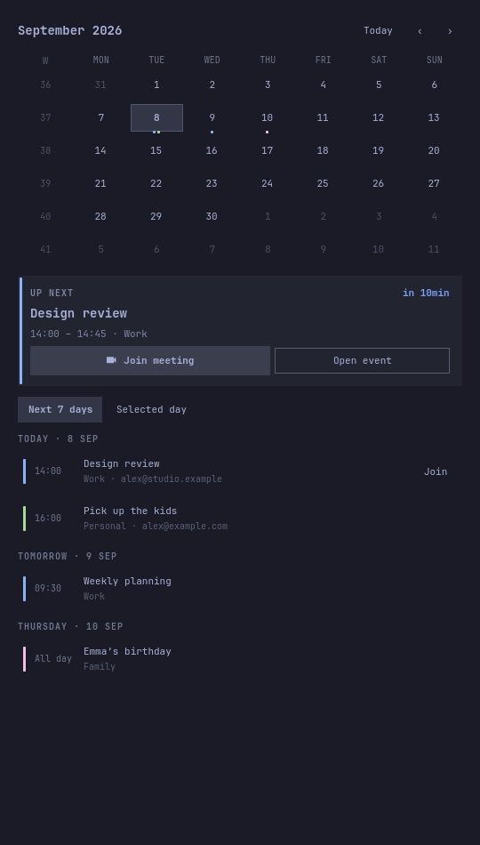

# Calendar & Agenda for Omarchy

An Omarchy clock with a month calendar, a prominent next-meeting card, and an agenda grouped by day. Connect multiple Google accounts and choose which calendars to display.

The UI combines [Calendar for Omarchy](https://github.com/tmn73/omarchy-calendar)'s month grid and clock with [NextEvent](https://github.com/tobiasz-p/next-event)'s meeting card and grouped agenda. MIT attribution is preserved in LICENSE. Maintained by [sorenmat](https://github.com/sorenmat), plugin ID `smo.calendar`.



## Install

```sh
git clone https://github.com/sorenmat/omarchy-calendar.git
cd omarchy-calendar
```

Then install this checkout:

Requires Omarchy 4 with the current Quickshell shell, Python 3, `secret-tool` (Arch package `libsecret`), an unlocked Secret Service keyring, and a browser.

```sh
python3 install.py
omarchy-shell shell rescanPlugins
```

The installer links this checkout into `~/.config/omarchy/plugins/smo.calendar`, replaces the built-in clock entry, and saves a timestamped backup of `shell.json`. Other bar entries and preferences are preserved. Keep this checkout in place. Plugin discovery and settings hot-reload. If code edits are still cached after a rescan, use `omarchy restart shell`.

## Connect Google

Open the widget → settings → **Connect Google account**. Sign in in your browser and approve both read-only Calendar permissions. Repeat for additional Google accounts.

The publisher supplies a Google Desktop OAuth registration in `oauth-client.json` at the plugin root (the Google download's `installed` object). The publisher’s registration is configured locally while Google verification is in progress and is not included in this source repository. Until the public OAuth release, use **Advanced setup → Import credentials…** with your own Desktop client. It identifies the app; each user's access and refresh tokens remain private in their own keyring. The helper uses fixed Google endpoints rather than endpoint URLs from the credentials file.

**Advanced setup → Import credentials…** lets a user select their own Desktop registration. This local override takes precedence for new accounts. Existing accounts reconnect and refresh using the registration they originally authorized.

### Publisher or custom-client setup

1. In your Google Cloud project, enable **Google Calendar API**.
2. Configure the Google Auth Platform audience and consent screen. For development in Testing, add your accounts as test users. Google expires External/Testing refresh tokens after seven days with Calendar scopes; configure production publishing before relying on it daily.
3. Declare `calendar.calendarlist.readonly` and `calendar.events.readonly` (both prefixed by `https://www.googleapis.com/auth/`). Identity also uses `openid` and `email`.
4. Create an OAuth client of type **Desktop app**, and download its JSON file. For the shared registration, supply it as `oauth-client.json`; for a local override, use Advanced setup to import it. Public distribution also requires the applicable Google verification.

No hosted backend. The helper binds a temporary callback listener to `127.0.0.1`, validates OAuth state, and exchanges the code with PKCE S256. Google user tokens and imported overrides are stored through Secret Service, never in the plugin config or logs. Workspace administrators may need to approve access.

Each account has an independent sync status and cache. Sync runs on shell startup and every five minutes while the widget is enabled. Failed syncs retain the last good events. Refresh uses the `↻` button. Empty calendars remain selectable. Shared events are deduplicated **after** calendar visibility filtering.

## Calendar controls

- Click a day for its complete agenda, including earlier events.
- **Next 7 days** shows the upcoming agenda, grouped by day.
- The meeting card follows a live meeting, then the next timed event. All-day and declined events never take over the card.
- **Join meeting** opens its HTTPS video link; **Open event** opens Google's event page.
- Arrow keys select days; `[` / `]` change month; `t` returns to today; `r` refreshes; `s` opens settings; `m` joins the featured meeting. Tab moves between controls; Escape backs out or closes.
- Right-click the bar clock to cycle its date format.

The read-only sync expands recurring events through Google and normalizes them in your local IANA timezone. It fetches the past 31 days and next 93 days. Dates outside that range are labelled. Calendars with only free/busy access cannot supply event details and are omitted.

State: `${XDG_STATE_HOME:-~/.local/state}/smo.calendar/events.json`, containing calendar metadata, account email addresses and cached events. Files are written atomically with private permissions. Removing an account clears its keyring token and local cache; it does not change Google events. To revoke the grant at Google too, use your Google Account's third-party connections page.

## CLI and checks

```sh
./calendarctl connect --client /path/to/desktop-credentials.json
./calendarctl connect
./calendarctl sync
./calendarctl status
./calendarctl remove ACCOUNT_ID
node --test tests/model.test.js
PYTHONPATH=sync python3 -m unittest discover -s tests -t .
omarchy plugin validate .
tests/preview.sh /tmp/calendar-preview.png
tests/preview.sh /tmp/calendar-accounts.png settings
```

The older upstream `sync/setup` and `omarchy-calendar-sync` files remain for reference, but this fork uses `calendarctl` and does not install that upstream timer or depend on `gws`.

## Validation limits

UI previews use synthetic events. Offline tests cover callback validation, token handling, account isolation, partial failures, pagination, date normalization, and calendar filtering. Live Google consent and refresh have not yet been validated against an account. Google verification is still in progress.

## Policies

[Privacy policy](PRIVACY.md) · [Terms of use](TERMS.md) · [MIT license](LICENSE)
